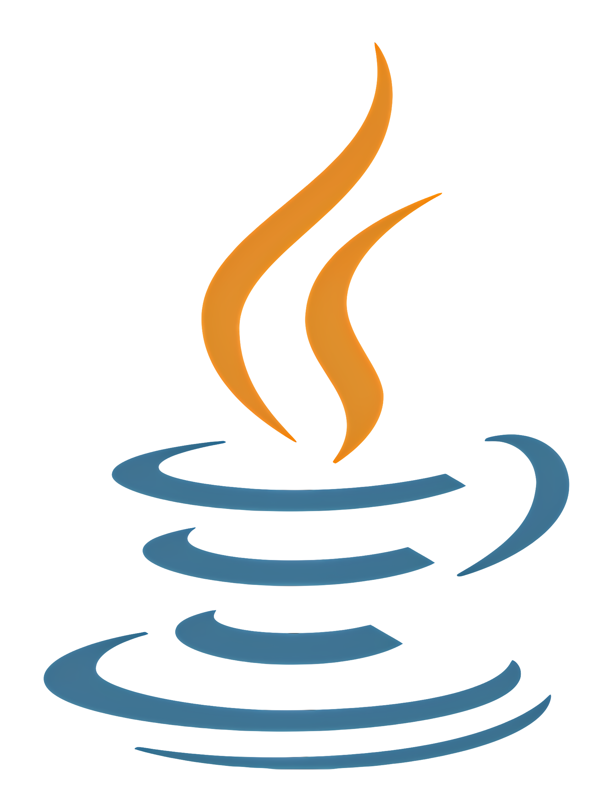
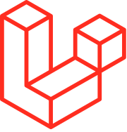

<h1 align="center">Hi 👋, I'm Amirhossein Emadi</h1>
<h3 align="center">A passionate fullstack developer from Iran</h3>

- 🌱 I’m currently learning **Laravel, React and Git**

- 💬 Ask me about **PHP, HTML, CSS and Javascript**

- 📫 How to reach me **emadi.henker404@gmail.com**

- ⚡ Fun fact **I think I am punctual, organized, kind, and open to criticism**

<h3 align="left">Connect with me:</h3>

## Languages :

| C#                                                                         | PHP                                                                  | HTML                                                                    | CSS                                                                  | JavaScript                                                                | Python                                                                        | Java                                                                    | English                                                          |
| -------------------------------------------------------------------------- | -------------------------------------------------------------------- | ----------------------------------------------------------------------- | -------------------------------------------------------------------- | ------------------------------------------------------------------------- | ----------------------------------------------------------------------------- | ----------------------------------------------------------------------- | ---------------------------------------------------------------- |
|  |  |  |  |  |  |  |  |
| Learning                                                                   | 90%                                                                  | 100%                                                                    | 70%                                                                  | 50%                                                                       | 20%                                                                           | 40%                                                                     | Learning                                                         |

## Frameworks :

| Laravel                                                                          | Next.js                                                                         |
| -------------------------------------------------------------------------------- | ------------------------------------------------------------------------------- |
|  |  |
| 60%                                                                              | 20%                                                                             |

## Libraries :

| React                                                                       | jQuery                                                                        | Tailwind css                                                                       |
| --------------------------------------------------------------------------- | ----------------------------------------------------------------------------- | ---------------------------------------------------------------------------------- |
|  |  |  |
| 40%                                                                         | 50%                                                                           | 100%                                                                               |

## Tools :

| Git                                                                  |
| -------------------------------------------------------------------- |
|  |
| 80%                                                                  |
